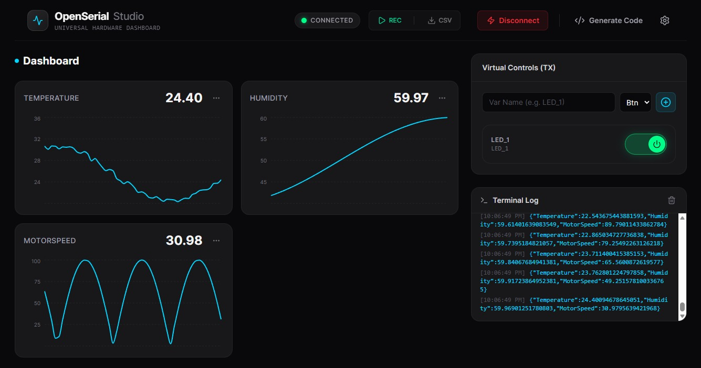

<div align="center">
  
  <br/>
  <h1>OpenSerial Studio</h1>
  <h3>A Zero-config, Universal Web Serial Dashboard for Hardware and IoT</h3>
  <p>Seamlessly visualize, control, and log telemetry from ANY microcontroller in real-time right from your browser.</p>

  <p>
    <a href="https://react.dev/"></a>
    <a href="https://vitejs.dev/"></a>
    <a href="https://tailwindcss.com/"></a>
    <a href="https://developer.mozilla.org/en-US/docs/Web/Progressive_web_apps"></a>
    <a href="https://opensource.org/licenses/MIT"></a>
  </p>

  
</div>

---

## 📖 Introduction

**OpenSerial Studio** is an advanced, platform-agnostic web dashboard built for hardware engineers, embedded developers, and hobbyists. By leveraging the modern Web Serial API, it communicates directly with serial devices (via USB or UART) without requiring any backend servers, local daemons, or complicated setup.

The defining philosophy of OpenSerial Studio is its **Universal Architecture**. It doesn't care whether you use an 8-bit Arduino Uno, an ESP32, an STM32 ARM Cortex, or a custom ASIC. As long as your microcontroller can send and receive standard JSON strings via Serial, OpenSerial Studio will instantly auto-generate an interactive, high-performance UI to control and visualize it. 

Whether you are debugging a PID controller, monitoring unlimited environmental sensors, or designing an IoT product, OpenSerial Studio provides a beautifully crafted, zero-config workspace.

## ✨ Core Capabilities

### 1. Universal Support (Unlimited MCUs & Sensors)
- **Hardware Agnostic:** Supports Arduino, ESP8266/ESP32, STM32 (HAL/LL), Raspberry Pi Pico, and literally any device with a UART interface.
- **Unlimited Components:** Supports an infinite variety of sensors (temperature, IMU, LiDAR) and actuators (servos, relays, motors). The MCU acts as a translator, packaging I2C/SPI data into JSON (e.g., `{"Temp": 25.4}`). The UI adapts automatically.

### 2. Zero-config Widget Engine
- **Auto-Discovery:** No frontend coding required. Send `{"MotorSpeed": 100}` and the dashboard instantly spins up a real-time tracking widget.
- **Multi-mode Charts:** Widgets can be toggled on-the-fly between **Line Charts**, **Bar Charts**, and **Gauge Charts** via the settings menu.
- **Bi-directional Control:** Create Virtual Controls (Buttons and Sliders) directly on the UI to send commands back to the hardware. 

### 3. Industrial-Grade Performance
- **Smart Throttling (50ms):** Handles immense serial data floods (115200 baud and beyond) flawlessly. The 50ms rendering throttle ensures a silky smooth 60FPS UI without freezing the browser or dropping data packets.
- **Brutalist Dark-Tech UI:** Designed for the modern engineer. Clear typography, industrial aesthetics, and zero fluff.

### 4. Advanced Data Logger
- **One-click Recording:** Record all incoming hardware telemetry in the background, fully independent of the UI chart history.
- **CSV Export:** Export thousands of data points instantly to `.csv` for Excel analysis, graphing, or machine learning datasets.

### 5. Auto Code Generator
- **Multi-Platform Support:** Click the "Generate Code" button to automatically get production-ready boilerplates for **Arduino**, **STM32 (HAL)**, and **MicroPython (ESP32/Raspberry Pi Pico)**.
- **Smart Pin Mapping (Arduino):** Instead of generating generic code, the software now intelligently assigns real hardware pins based on your UI setup:
  - **Sensors (Charts/Gauge):** Automatically mapped to Analog pins (A0, A1, A2...) using \`analogRead()\` to fetch real-world data.
  - **Controls (Buttons/Sliders):** Automatically mapped to Digital/PWM pins (2, 3...) using \`digitalWrite()\` or \`analogWrite()\` for real-world actuation.
## 🚀 Getting Started

### Prerequisites
- Node.js (v18+)
- A Chromium-based browser (Chrome, Edge, Opera) to support the Web Serial API.

### Installation

1. Clone the repository:
   ```bash
   git clone https://github.com/ptai-eng/OpenSerial-Studio.git
   cd OpenSerial-Studio
   ```

2. Install dependencies:
   ```bash
   npm install
   ```

3. Start the development server:
   ```bash
   npm run dev
   ```

4. Build for production (PWA enabled):
   ```bash
   npm run build
   ```

## 🔌 Hardware Implementation Example (Arduino)

To make your hardware talk to OpenSerial Studio, simply output standard JSON over Serial:

```cpp
void setup() {
  Serial.begin(115200);
}

void loop() {
  float temperature = readTemperature();
  int lightLevel = readLight();
  
  // Format as JSON and send
  Serial.print("{\"Temp\": ");
  Serial.print(temperature);
  Serial.print(", \"Light\": ");
  Serial.print(lightLevel);
  Serial.println("}");
  
  delay(100);
}
```

## 🛠 Tech Stack
- **Framework:** React 18 + Vite 5
- **Styling:** Tailwind CSS v4
- **Animations:** Framer Motion
- **Charts:** Recharts
- **PWA:** vite-plugin-pwa

## 📄 License
This project is licensed under the MIT License.
